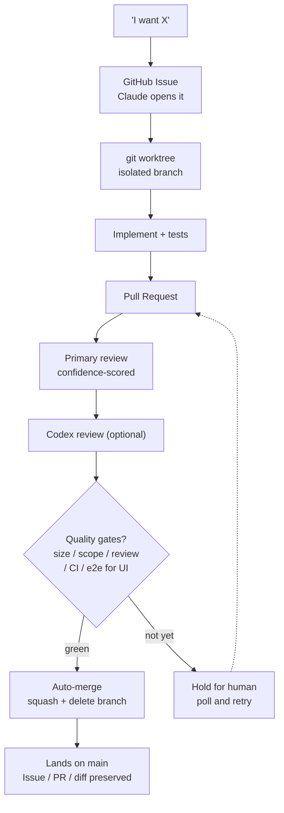

# cc-autoship

> [English](./README.md) | **日本語**

**AI の開発作業を、追跡可能な資産に変える — GitHub の上で。**

cc-autoship は、AI の稼働をすべて GitHub の Issue・PR・diff・レビューとして記録する Claude Code 向けのハーネス群（OSS）です。GitHub の Issue を起点に、worktree 作成 → 実装 → PR → レビューまでを一続きで実行し、ゲートが緑なら人間を最終ゲートとしてマージします。単体のプラグインというより、実際の開発で使われている GitHub のフローに、追加課金なしで AI の稼働を接続する仕掛けです。**任せても、辿れる。何かあっても、あなたが巻き取れる。**

## なぜ cc-autoship か

AI に実装を任せられる時代になりました。でも任せた結果「一体何をしたのか」が後から追えないなら、あなたはその成果に責任を持てません。cc-autoship は、AI の稼働をすべて GitHub の Issue・PR・diff・レビューとして記録します。**任せても、辿れる。何かあっても、あなたが巻き取れる。**

Claude を並列でたくさん走らせるのは強力です。でも作業はチャットの中に閉じてしまい、追いにくく振り返りにくくなります。

cc-autoship は、あなたの「こうしたい」という思いつきを GitHub の Issue 駆動フローに自動で乗せます。**何も意識しなくても、Issue → PR → レビュー → 品質ゲート → マージ という"正しい開発ワークフロー"が仕組みで回り**、作業は消えていく会話ではなく、**レビューでき・振り返れる資産**として GitHub に残ります。

- **思いつきが Issue になる。** やりたいことを言うだけ。Claude が GitHub Issue を作成します。
- **Issue が PR を駆動する。** worktree で実装され、プルリクエストになります。
- **レビューを経てマージ。** AI による一次レビュー（Codex による二次レビューにも対応）を通り、設定した品質ゲートが緑なら自律マージ。
- **リポジトリを汚さない。** 変更は必ず worktree + PR を経由し、ゲートを通った PR だけが `main` に入る。中途半端なコミットや直 push で散らかりません。

Issue・PR・差分がすべて GitHub に残るので、何を・なぜ作ったかが正確に見えます。何かあっても、あなたが巻き取れる。実際の開発チームと同じ Issue 駆動フローなので、開発知識が浅くても同じやり方で進められます。

cc-autoship 自体も、この仕組みで開発しています。2026 年 6 月時点で、ピーク週には 90 件超の PR を、API の従量課金なし・定額サブスク（Claude Max 5x 以上推奨）と GitHub の無料枠の中でマージしました。同じ週の Issue 更新は 100 件超、1 日の PR マージは多い日で 30 件超です（Claude Max 5x プランでの実績・概数）。もちろん限界もあります — スパイク時は手動マージで凌ぐ、完全自動ではなく「自動 + 人間の最終ゲート」です。→ [制限事項](#制限事項)

## 設計思想 — 3 本柱

新しい仕組みを発明するより、実際の人間の開発で使われている仕組み（Issue・PR・レビュー）をそのまま流用するのが一番だと考えました。この 3 つは独立した機能というより、「無駄なく資産を残す」という一つの考え方の三面です。

- **辿れる / Traceable** — すべての変更を Issue・PR・diff・レビューとして GitHub に残す。あとから流れを辿れ、AI に「なぜこうしたのか」と聞ける。
- **積み上がる / Compounding** — 実装を適切な粒度で PR にまとめ、ゲートを通ったものだけが `main` に入る。粒度の揃った PR が積み上がり、そのまま「見返せる・振り返れる」資産になる。
- **続けられる / Sustainable** — GitHub Actions の従量課金に頼らず、レビュー → コメント → 修正を定額サブスク（Claude Max 5x 以上推奨）と GitHub の無料枠の中で回す。

## こんな人に

- **AI で個人開発するエンジニア（solo founder / インディー開発者）。** 並列 Claude セッションの作業を、散らからず・追える状態に保ちたい。「AI に任せた結果」に責任を持ちたい人。
- **バイブコーディングから本開発へ進みたい人。** POC 止まりを越えて、開発チームの型（Issue 駆動・TDD・レビュー）が埋め込まれたフローに「乗るだけ」で進みたい人。

## はじめる（Getting started）

### 要件（Requirements）

- **[GitHub CLI](https://cli.github.com/)（`gh`）+ 認証済み** — `gh auth login` を実行。ループ全体が `gh` 経由で GitHub（Issue / PR / マージ）を操作します。
- **`git`** — worktree / ブランチに使用。
- **[`jq`](https://jqlang.github.io/jq/)** — hook のゲート判定が GitHub の JSON 解析に使用。
- *(任意)* **Node.js / `npm`** — プロジェクトの JS lint / テストをゲートで回す場合のみ。
- *(任意)* **[openai/codex-plugin-cc](https://github.com/openai/codex-plugin-cc)** — 任意の Codex 二次レビューを有効化（下記 [オプション統合](#オプション統合) 参照）。

### インストール（Install）

Claude Code セッション内で、marketplace を追加してプラグインをインストールします:

```bash
# 1. cc-autoship の marketplace を追加（本リポジトリ）
/plugin marketplace add maee-co/cc-autoship

# 2. プラグインをインストール — <plugin>@<marketplace>
/plugin install cc-autoship@cc-autoship-marketplace

# 3. リロードして新しい commands / skills / hooks を読み込む
/reload-plugins
```

これで commands / skills / rules / hooks が Claude Code セッションで使えるようになります。

> **アップデートについて**: プラグインは**インストールした時点の commit に固定**され、
> このリポジトリへのその後の push を自動では追従しません。新しいリリースを取り込むには:
>
> ```bash
> /plugin marketplace update cc-autoship-marketplace
> /plugin update cc-autoship
> ```
>
> を実行してリロードしてください。`/review` や `/auto-merge` が「スクリプトが見つからない」と
> 報告する場合は、ほぼ確実に古いインストールを使っています — まず更新とリロードを。

### クイックスタート（Quick start）

あとは、リポジトリ内の Claude Code セッションで **やりたいことを言うだけ** — ループが自走します:

1. **やりたいことを伝える** → Claude が GitHub Issue を作成（`gh issue create`）。
2. **worktree で実装** → 隔離した `feat/...` ブランチ＋テスト。
3. **PR を作成**（`Closes #<issue>`）→ hook が `/review` を自動起動。
4. **ゲート評価** → サイズ / スコープ / レビュー / CI（UI は + e2e）を満たせば `/auto-merge` が squash マージし、Issue が close。

各ステップを直接呼ぶことも可能: `/github-issue-impl <n>`、`/review`、`/auto-merge`。

> ループは hook が enforce する [`rules/dev-flow.md`](./rules/dev-flow.md) に従います。

> [!TIP]
> 複数の案件やクライアントを横断する場合は、案件ごとに config ディレクトリを分けてメモリ / 設定を隔離できます: `export CLAUDE_CONFIG_DIR=~/.claude-project-x`（詳細は [docs/optional-integrations.md](./docs/optional-integrations.md)）。

## 自律マージを有効化する（任意）

Claude Code は既定で、PR をマージする前に確認を求めます。cc-autoship にこの最後の一手（ゲートを通した PR のマージ）を確認なしで完了させたい場合は、`gh pr merge` の実行権限を付与します。`.claude/settings.local.json`（無ければ作成）に以下を追加してください:

```json
{
  "permissions": {
    "allow": ["Bash(gh pr merge:*)"]
  }
}
```

これは自分のリポジトリで自分が行う一度きりの選択です — cc-autoship があなたの設定を書き換えることはありません。変わるのは「最後のマージで確認を求めるか」だけで、どの PR がマージ対象かはゲート（`/review`・サイズ・スコープ・CI・公開コンテンツ保護）が引き続き決めます。設定しなければ、マージは手動のワンクリック操作のままです。

> **既に許可済みの場合**: ユーザーレベルの `~/.claude/settings.json` が既に `gh` を広く許可している（例: `Bash(gh:*)`）、またはクローンした repo が committed の `.claude/settings.json` にこの許可を同梱している場合、`gh pr merge` は既に許可されています — この手順は no-op です。追加前に `/permissions` で確認してください。

## 仕組み（How it works）

### ワークフロー



`main` への直接 push はブロックされます。`main` に入る唯一の経路は、ゲートを通った PR だけです。

### 仕組みが担保すること

**どのリポジトリでも常に効く:**

- **`main` への直接 push をブロック** — 必ず worktree + PR 経由
- **ゲート付き自律マージ** — サイズ（500 行 / 10 ファイル以内）・レビュー判定 pass（Critical / Major ゼロ）・危険操作判定を満たし、draft でない PR だけがマージされる（サイズのみ、新規アプリを丸ごと追加する初期 PR は免除）
- **判定は決定的** — ゲートは LLM プロンプトでなく、テスト済みの bash 純関数。合格判定を出すのは、コードを書いたモデル自身ではない

**設定して初めて効く（構成に応じた追加の層）:**

- **公開コンテンツの保護** — 公開指定したパスは自動マージしない（未設定なら無効）
- **スコープ保護** — アプリ横断・共有パッケージの変更を止める（`apps/` + `packages/` 構成が前提）
- **e2e ゲート** — UI 変更は L1 spec の e2e を待つ（`frontend-apps.txt` への登録が前提）
- **CI ゲート** — マージ前にあなたの CI を待つ（CI が無いリポジトリでは待たない）

### 同梱されるもの

**Core loop（中核）**

| Command / Skill | 役割 |
| --- | --- |
| `/commit-push` | スコープ/フロー チェック → レビュー → コミット → push を一気通貫 |
| `/review` | 信頼度スコアリング付きのシニアレビュー（誤検知を除外）。`--fix` で自動修正 |
| `/auto-merge` | 品質ゲートを評価し、満たせば squash 自律マージ。待ち時はポーリング |
| `/checkpoint` | 進捗を GitHub Issue に退避し、別セッションで再開 |
| `/github-issue-impl` | GitHub Issue を読み込み → 調査 → 計画 → 実装 |
| `/pr-context-summary` | 意思決定・背景を Issue に記録（pre / post-merge） |
| `/codex-secondary-review` | 外部モデルによる opt-in の二次レビュー |

**Quality & guardrails**

| Skill | 役割 |
| --- | --- |
| `/monorepo-manager` | commit 前にスコープ / フロー遵守をチェック |
| `/devils-advocate` | 設計・計画を批判的にレビュー（エッジケース / 前提） |
| `/cc-bestpractice` | Claude Code 設定をベストプラクティスに追従 |
| `/session-retro` | セッションを振り返り、skill / hook / rule 改善を提案 |

加えて **rules**（`dev-flow` / `code-review` / `testing` / `security` 等）も同梱し、hook がこれらを enforce します。

## 設定（Configuration）

自動マージのゲートは [`scripts/claude-hooks/lib/auto-merge-criteria.sh`](./scripts/claude-hooks/lib/auto-merge-criteria.sh)（テスト済みの純 bash）にあります。**すべて**満たした PR だけが自動マージされます:

| ゲート | 通過条件 |
| --- | --- |
| サイズ | **実コード** 差分 ≤ 500 行 かつ ≤ 10 ファイル — テスト（`*/__tests__/*`・`*.test.*`・`*.spec.*`）と `*.md` は行数から除外 |
| スコープ | infra または単一アプリのみ — 複数 `apps/*` 横断や shared `packages/*` は NG |
| 公開コンテンツ | 公開指定パスに 1 つも触れていない（下記） |
| レビュー | 最新の `/review` に `[Critical]` / `[Major]` 指摘がゼロ（かつレビューが存在する） |
| 危険操作 | migration / `*.sql` / 認証 / 課金系ファイルなし、PR 本文に破壊的キーワードなし |
| opt-out | PR 本文に `[manual-merge]` 行がない |
| draft | PR が draft でない |
| e2e（UI） | UI 変更が L1 spec を持つフロントアプリに及ぶ場合、その e2e CI が pass |

ゲート通過後、`/auto-merge` はマージ前に CI を待ちます（`gh pr checks --watch --fail-fast`）。つまり **リポジトリ自身の CI チェックも強制されます**。CI チェックが 1 つも設定されていない（`statusCheckRollup` が空の）PR ではこの待機をスキップしてマージへ進みます。つまり **CI 未設定のリポジトリでも、上記ゲートを満たせば自動マージされます**。

**設定するもの:**

- **公開パス**（自動マージ禁止） — [`scripts/claude-hooks/data/public-content-paths.txt`](./scripts/claude-hooks/data/public-content-paths.txt) に 1 行 1 パスで記載（完全一致 or `<dir>/` 前方一致）。場所は `PUBLIC_CONTENT_PATHS_FILE` で変更可。空なら保護オフ（fail-open）。
- **フロントアプリ**（e2e 必須対象） — [`scripts/claude-hooks/data/frontend-apps.txt`](./scripts/claude-hooks/data/frontend-apps.txt) に記載。`FRONTEND_APPS_FILE` で上書き可。空なら e2e 必須化オフ。
- **サイズ / ファイル上限** — `AUTO_MERGE_MAX_LINES`（500）と `AUTO_MERGE_MAX_FILES`（10）は `auto-merge-criteria.sh` 冒頭の定数。変更はそこを編集。

> スコープ判定は `apps/` + `packages/`（モノレポ的）構成を前提にしています。単一パッケージのリポジトリでは単に発火しません。危険操作判定は構成によらず動きます。

## 構成（Layout）

```
cc-autoship/
├── .claude-plugin/              # plugin.json + marketplace.json
├── commands/                    # /review, /auto-merge, /commit-push
├── skills/                      # dev-flow 系スキル
├── agents/                      # researcher（隔離調査）, reviewer（客観レビュー）
├── hooks/hooks.json             # lifecycle hook 配線（${CLAUDE_PLUGIN_ROOT} 経由）
├── scripts/claude-hooks/        # hook 本体 + 純関数 lib + テスト
├── rules/                       # コーディング / レビュー / テスト方針
└── docs/                        # オプション統合 / データプライバシー
```

## オプション統合

Codex 二次レビューは **opt-in** です。cc-autoship は GitHub だけで動作し、外部サービスは不要です。

二次レビューは **[openai/codex-plugin-cc](https://github.com/openai/codex-plugin-cc)** を経由します — 先にこのプラグインを導入してください（`/codex-secondary-review` が呼ぶ `codex:codex-rescue` agent を提供し、ローカルの Codex CLI に委譲します）。導入後、PR 本文に `[codex-review]` を付けると起動します。

セットアップ手順は [docs/optional-integrations.md](./docs/optional-integrations.md) を参照してください。有効化すると、二次レビューは PR の diff を外部モデルへ送信します — [データプライバシー方針](./docs/DATA_PRIVACY_POLICY.md) を参照してください。

## 制限事項

- **スパイク時は手動が要る。** PR が一気に集中すると、GitHub 無料枠の Actions 分数が尽きて CI が詰まることがあります。その日はゲートを通った PR を手動でマージします。どの PR がマージ対象かはゲートが決めたまま — 最後のボタンを自分で押すだけです。
- **スコープ保護はモノレポ前提。** スコープ判定は `apps/` + `packages/` 構成を前提にしています。単一パッケージのリポジトリでは発火しません（fail-open）。アプリ横断の影響範囲そのものが存在しないため実害は出ませんが、モノレポで得られるスコープ保護は載りません。
- **本文は日本語中心。** 同梱の skills / rules / commands の本文は日本語中心です（英語化は roadmap 項目）。どの言語のセッションでも動作しますが、プロンプト・文面は現状日本語が主です。

## ライセンス

[MIT](./LICENSE) — 商用利用を含め自由に利用可能。
