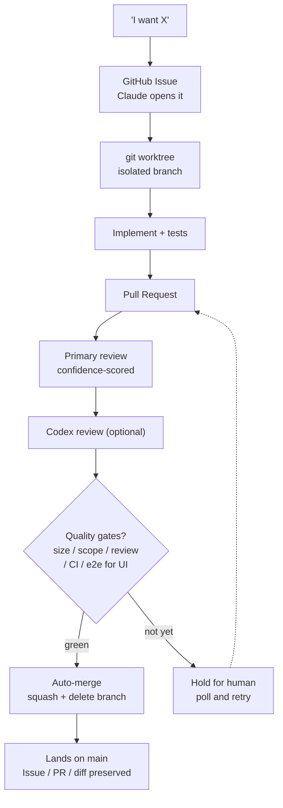

# cc-autoship

> **English** | [日本語](./README.ja.md)

**Turn AI's development work into a traceable, reviewable asset — on GitHub.**

cc-autoship is a set of Claude Code harnesses (OSS) that record every AI action as GitHub Issues, PRs, diffs, and reviews. From a GitHub Issue it spins up a worktree, implements, opens a PR, and reviews — and once your gates are green it merges, with a human as the final gate. Less a standalone plugin than a way to wire AI's work onto the same GitHub flow real teams already use, with no metered billing on top. **Delegate the work, and you can still trace it — and take it back over if anything goes wrong.**

## Why cc-autoship

You can delegate implementation to AI now. But if you can't trace what it actually did, you can't stand behind the result. cc-autoship records every AI action as GitHub Issues, PRs, diffs, and reviews. **Delegate the work — keep the accountability.**

Running many Claude sessions in parallel is powerful — but the work stays trapped in chat. It's hard to track what got built and to look back on it later.

cc-autoship puts every "I want X" through GitHub's Issue-driven loop automatically. **Without thinking about process, you get a proper workflow — Issue → PR → review → quality gates → merge — running by mechanism**, and your work lands on GitHub as a reviewable, retrospectable asset instead of disappearing into chat.

- **A passing thought becomes an Issue.** Just say what you want, and Claude opens a GitHub Issue for it.
- **The Issue drives a PR.** Implementation happens in a worktree and lands as a pull request.
- **Reviewed, then merged.** An AI primary review (with an optional Codex secondary review); if your quality gates are green, it merges itself.
- **Your repo stays clean.** Every change goes through a worktree + PR, and only gated PRs reach `main` — no half-baked commits, no direct-to-`main` mess.

Because Issues, PRs, and diffs all live on GitHub, you can see exactly what was built and why — and if something goes wrong, you can take it back over. It's the same Issue-driven flow real teams use, so you can work like a developer even without deep dev expertise.

The author develops cc-autoship with cc-autoship. As of June 2026, a peak week merged 90+ pull requests — with no metered API billing, on a flat-rate subscription (Claude Max 5x or higher recommended) inside GitHub's free tier — alongside 100+ Issue updates that week and 30+ merges on the busiest day (approximate figures, on a Claude Max 5x plan). It has real limits too: on big spikes you fall back to merging by hand — auto plus a human final gate, not full automation. See [Known limitations](#known-limitations).

## Three pillars

Rather than invent something new, cc-autoship reuses the machinery real teams already develop with — Issues, PRs, reviews. These aren't three separate features but three faces of one idea: *leave a clean, reusable record without waste.*

- **Traceable** — every change is recorded as an Issue, PR, diff, and review on GitHub, so you can follow what was built and why — and ask the AI later.
- **Compounding** — changes are grouped into right-sized PRs; only gate-cleared work reaches `main`, so a reviewable, retrospectable record compounds instead of scattering across raw commits.
- **Sustainable** — no metered GitHub Actions billing; review → comment → fix runs inside a flat-rate subscription (Claude Max 5x or higher recommended) and GitHub's free tier.

## Who is this for

- **Engineers building solo with AI — solo founders, indie hackers.** You run parallel Claude sessions and want the work to stay trackable and accountable, not scattered across chat.
- **People moving from vibe-coding to real shipping.** You've hit the POC ceiling and want a real team's workflow — Issue-driven, TDD, review — baked in, so you can just get on the rails.

## Getting started

### Requirements

- **[GitHub CLI](https://cli.github.com/) (`gh`), authenticated** — run `gh auth login`. The whole loop drives GitHub (Issues, PRs, merge) through `gh`.
- **`git`** — for worktrees and branches.
- **[`jq`](https://jqlang.github.io/jq/)** — the hook gate logic parses GitHub JSON with it.
- *(optional)* **Node.js / `npm`** — only if your project runs JS lint/tests as part of the gates.
- *(optional)* **[openai/codex-plugin-cc](https://github.com/openai/codex-plugin-cc)** — enables the optional Codex second-pass review (see [Optional integrations](#optional-integrations)).

### Install

Inside a Claude Code session, add the marketplace and install the plugin:

```bash
# 1. Add the cc-autoship marketplace (this repo)
/plugin marketplace add maee-co/cc-autoship

# 2. Install the plugin — <plugin>@<marketplace>
/plugin install cc-autoship@cc-autoship-marketplace

# 3. Reload so the new commands / skills / hooks load
/reload-plugins
```

The commands, skills, rules, and hooks are now available in your Claude Code sessions.

> **Updating**: a plugin install is **pinned to the commit it was installed from** — it does
> not follow later pushes to this repo. To pick up a new release:
>
> ```bash
> /plugin marketplace update cc-autoship-marketplace
> /plugin update cc-autoship
> ```
>
> then reload. If `/review` or `/auto-merge` ever reports missing scripts, you are almost
> certainly running a stale install — update and reload first.

### Quick start

In a Claude Code session inside your repo, just say what you want — the loop runs itself:

1. **Describe the work.** Claude opens a GitHub Issue for it (`gh issue create`).
2. **It implements in a worktree.** An isolated `feat/...` branch, with tests.
3. **It opens a PR** (`Closes #<issue>`); a hook auto-fires `/review`.
4. **Gates are evaluated.** Pass size / scope / review / CI (+ e2e for UI) → `/auto-merge` squash-merges and the Issue closes.

You can also drive any step directly: `/github-issue-impl <n>`, `/review`, `/auto-merge`.

> The loop follows [`rules/dev-flow.md`](./rules/dev-flow.md), which the hooks enforce.

> [!TIP]
> Working across several projects or clients? Set a per-project config dir to keep memory and settings isolated: `export CLAUDE_CONFIG_DIR=~/.claude-project-x` (see [docs/optional-integrations.md](./docs/optional-integrations.md)).

## Enabling autonomous merge (optional)

By default, Claude Code asks you to confirm before it merges a pull request. To let cc-autoship complete that last step without a prompt — merging PRs that have already passed its gates — grant it permission to run `gh pr merge`. Add this to your `.claude/settings.local.json` (create the file if it does not exist):

```json
{
  "permissions": {
    "allow": ["Bash(gh pr merge:*)"]
  }
}
```

This is a one-time choice you make in your own repo — cc-autoship never edits your settings for you. It only changes whether the final merge is prompted; the gates (`/review`, size, scope, CI, public-content guard) still decide which PRs are eligible. Leave it unset to keep merging as a manual one-click step.

> **Already covered?** If your user-level `~/.claude/settings.json` already allows `gh` broadly (e.g. `Bash(gh:*)`), or a repo you cloned ships this grant in its committed `.claude/settings.json`, `gh pr merge` is already permitted — this step is a no-op. Check with `/permissions` before adding it.

## How it works

### Workflow



Direct pushes to `main` are blocked — the only path onto `main` is a gated PR.

### What the mechanism guarantees

**Always on, in any repo:**

- **No direct pushes to `main`** — always via a worktree + PR
- **Gated auto-merge** — a PR merges only if it clears size (≤500 lines / ≤10 files), a passing review verdict (zero Critical/Major), and dangerous-op checks, and isn't a draft (size alone is waived for the initial PR that adds a whole new app)
- **Deterministic checks** — gates are tested bash pure functions, not LLM prompts. The passing verdict is not authored by the model that wrote the code

**On top, once you configure them:**

- **Public-content guard** — paths you mark as public are never auto-merged (unset = off)
- **Scope guard** — holds cross-app / shared-package changes (needs an `apps/` + `packages/` layout)
- **e2e gate** — UI changes wait on their L1 spec (needs `frontend-apps.txt`)
- **CI gate** — waits on your CI before merging (a repo with no CI checks doesn't wait)

### What's bundled

**Core loop**

| Command / Skill | Role |
| --- | --- |
| `/commit-push` | Scope & flow check → review → commit → push, in one shot |
| `/review` | Senior-level review with confidence scoring (filters false positives); `--fix` auto-applies |
| `/auto-merge` | Evaluates the gates, squash-merges autonomously, polls until merged |
| `/checkpoint` | Pause progress to a GitHub Issue and resume it in another session |
| `/github-issue-impl` | Read a GitHub Issue → investigate → plan → implement |
| `/pr-context-summary` | Record decisions and context onto the Issue (pre / post-merge) |
| `/codex-secondary-review` | Opt-in second-pass review by an external model |

**Quality & guardrails**

| Skill | Role |
| --- | --- |
| `/monorepo-manager` | Checks scope / flow compliance before commit |
| `/devils-advocate` | Critically reviews designs and plans (edge cases, assumptions) |
| `/cc-bestpractice` | Keeps the Claude Code setup aligned with best practices |
| `/session-retro` | Reviews a session and proposes skill / hook / rule improvements |

Plus **rules** — `dev-flow`, `code-review`, `testing`, `security`, and more — that the hooks enforce.

> [!NOTE]
> The bundled skills, rules, and commands are written primarily in Japanese, the author's working language. They run fine in sessions of any language, but their prose and prompts are Japanese-centric today. Full English localization is on the roadmap.

## Configuration

The auto-merge gates live in [`scripts/claude-hooks/lib/auto-merge-criteria.sh`](./scripts/claude-hooks/lib/auto-merge-criteria.sh) (pure, tested bash). A PR auto-merges only when **all** of these pass:

| Gate | Pass condition |
| --- | --- |
| Size | ≤ 500 lines of **production** diff and ≤ 10 files — tests (`*/__tests__/*`, `*.test.*`, `*.spec.*`) and `*.md` are excluded from the line count |
| Scope | Touches infra or a single app — not multiple `apps/*`, and no shared `packages/*` |
| Public content | Touches none of your public paths (see below) |
| Review | The latest `/review` has zero `[Critical]` / `[Major]` findings (and a review exists) |
| Dangerous ops | No migration / `*.sql` / auth / billing files, and no destructive keywords in the PR body |
| Opt-out | No `[manual-merge]` line in the PR body |
| Draft | The PR is not a draft |
| e2e (UI) | If a UI change hits a frontend app that has an L1 spec, its e2e CI must pass |

After the gates pass, `/auto-merge` waits on CI (`gh pr checks --watch --fail-fast`) before merging — so **your repo's own CI checks are enforced too**. If the PR has no CI checks configured (empty `statusCheckRollup`), this wait is skipped and the merge proceeds — so **a repo with no CI still auto-merges** once the gates above pass.

**What you configure:**

- **Public paths** (never auto-merged) — list them in [`scripts/claude-hooks/data/public-content-paths.txt`](./scripts/claude-hooks/data/public-content-paths.txt), one per line (exact match or `<dir>/` prefix). Point elsewhere with `PUBLIC_CONTENT_PATHS_FILE`. Empty list = guard off (fail-open).
- **Frontend apps** (e2e-enforced) — list them in [`scripts/claude-hooks/data/frontend-apps.txt`](./scripts/claude-hooks/data/frontend-apps.txt). Override with `FRONTEND_APPS_FILE`. Empty = e2e enforcement off.
- **Size / file limits** — `AUTO_MERGE_MAX_LINES` (500) and `AUTO_MERGE_MAX_FILES` (10) are constants at the top of `auto-merge-criteria.sh`; edit there to change them.

> **Plugin install:** the bundled `scripts/…` files live in the plugin cache, not your repo, and the two config files resolve differently (`public-content-paths.txt` → the cached copy; `frontend-apps.txt` → your repo). Prefer the env overrides above, or create `scripts/claude-hooks/data/frontend-apps.txt` in your repo to turn on e2e gating. See [docs/SETUP.md](./docs/SETUP.md) for details.

> The scope rule assumes an `apps/` + `packages/` (monorepo-ish) layout — on a single-package repo it simply never triggers. The dangerous-op rule works on any layout.

## Layout

```
cc-autoship/
├── .claude-plugin/              # plugin.json + marketplace.json
├── commands/                    # /review, /auto-merge, /commit-push
├── skills/                      # dev-flow skills
├── agents/                      # researcher (isolated research), reviewer (objective review)
├── hooks/hooks.json             # lifecycle hook wiring (via ${CLAUDE_PLUGIN_ROOT})
├── scripts/claude-hooks/        # hook bodies + pure-function libs + tests
├── rules/                       # coding / review / testing conventions
└── docs/                        # optional integrations, data privacy
```

## Optional integrations

Codex secondary review is **opt-in**. cc-autoship works with GitHub alone — no external services required.

The secondary review is delegated through **[openai/codex-plugin-cc](https://github.com/openai/codex-plugin-cc)** — install that plugin first (it provides the `codex:codex-rescue` agent that `/codex-secondary-review` calls, and runs through your local Codex CLI). Then add `[codex-review]` to a PR body to trigger it.

See [docs/optional-integrations.md](./docs/optional-integrations.md) for setup. When enabled, the secondary review sends the PR diff to an external model — see the [data privacy policy](./docs/DATA_PRIVACY_POLICY.md).

## Known limitations

- **Spike days need a hand.** When a burst of PRs lands at once, GitHub's free-tier Actions minutes can run dry and CI stalls — on those days you merge the gated PRs by hand. The gates still decide *what* is eligible; you just click the last button.
- **Scope protection assumes a monorepo.** The scope gate assumes an `apps/` + `packages/` layout. On a single-package repo it never triggers (fail-open). There is no cross-app blast radius to guard there, so nothing is lost in practice — but you don't get the scope protection a monorepo would give you.
- **Japanese-centric prose.** As noted above, the bundled skills / rules / commands are written primarily in Japanese. English localization is on the roadmap.

## License

[MIT](./LICENSE) — free to use, including commercial use.
